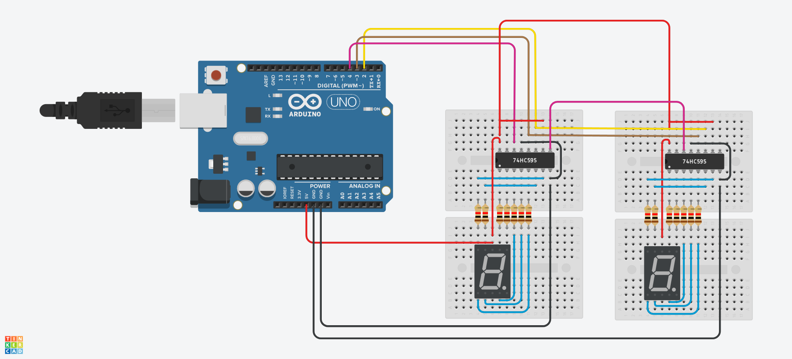

# 4.21
Arduino test with 7Segment

+ 7Segment_Count

  + 7segment를 연결하여 0부터 9까지 순차적으로 숫자를 세어가는 것을 반복한다.
  
 

+ 7Segment_Count_ShiftRegister

  + 7segment 2개와 shift register를 사용하여 0부터 99까지 숫자를 세는 것을 반복한다.
